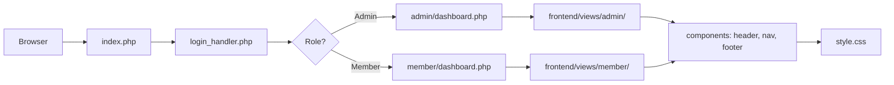
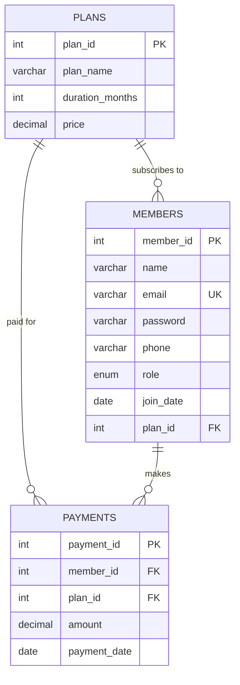

<p align="center">
  
</p>

<p align="center">
  
</p>

<br/>

<p align="center">
  A full-stack <strong>Gym Management System</strong> built with vanilla PHP and MySQL.<br/>
  <sub>Role-based dashboards · subscription tracking · payment management · editorial UI</sub>
</p>

<br/>

---

<br/>

###  &nbsp; Overview

**GymFlow** is a complete gym management web application with a clean backend/frontend separation — no frameworks, no libraries, just pure PHP, SQL, and a custom CSS design system.

Built as a hands-on project to learn **PHP**, **MySQL**, **XAMPP**, and full-stack web development from the ground up.

<br/>

| Area | Capabilities |
|:---|:---|
| **Admin Dashboard** | Real-time stats — total members, all-time revenue, monthly revenue, revenue trends |
| **Member Management** | Full CRUD — add, edit, delete members with validation |
| **Plan Management** | Create and manage subscription plans (Basic, Standard, Premium, Annual) |
| **Payment Tracking** | Record payments, auto-update member subscriptions, full payment history |
| **Member Portal** | Personal dashboard, profile management, subscription details, payment history |
| **Authentication** | Bcrypt password hashing, role-based access (admin/member), session management |
| **UI Design** | Editorial design system — clean typography, SVG icons, responsive layout |

<br/>

---

<br/>

###  &nbsp; Architecture

The application follows a strict **backend/frontend separation** — backend PHP files contain only logic, frontend templates contain only HTML.

```
Request → index.php → Login Handler → Role Check
                                         ├── Admin  → admin/*.php  → frontend/views/admin/*.php
                                         └── Member → member/*.php → frontend/views/member/*.php
```



<br/>

---

<br/>

###  &nbsp; Database Design

Three normalized tables with foreign key relationships.



> See [`database/`](database/) for the full SQL dump, schema screenshots, and ER diagram from phpMyAdmin.

<br/>

---

<br/>

###  &nbsp; Demo

<p align="center">
  <a href="https://youtu.be/Kt-FjpAB2Vg">
    
  </a>
  <br/>
  <sub>▶ Click to watch the full demo on YouTube</sub>
</p>

<br/>

---

<br/>

###  &nbsp; Quick Start

#### Prerequisites

| Requirement | Version |
|:---|:---|
| XAMPP | 8.2.4+ |
| PHP | 8.2+ |
| MySQL / MariaDB | 10.4+ |

<br/>

**1. Start XAMPP** — Launch **Apache** and **MySQL** from the XAMPP Control Panel.

**2. Set up the database** — Open [phpMyAdmin](http://localhost/phpmyadmin) and follow [`docs/DATABASE_SETUP.md`](docs/DATABASE_SETUP.md), or import the dump directly:

```
database/gym_management.sql
```

**3. Deploy** — Copy `gym_management/` to your XAMPP `htdocs/` folder and rename it to `gym`:

```bash
cp -r gym_management /path/to/xampp/htdocs/gym
```

> The folder must be named **`gym`** inside `htdocs/`. To use a different name, update `BASE_URL` in [`config.php`](gym_management/config.php).

**4. Open** — Navigate to [`http://localhost/gym/`](http://localhost/gym/)

**5. Login**

| Role | Email | Password |
|:---|:---|:---|
| Admin | `admin@gym.com` | `admin123` |
| Member | `aarav@example.com` | `aarav@123` |

> See [`docs/TEST_CREDENTIALS.md`](docs/TEST_CREDENTIALS.md) for all test accounts.

<br/>

---

<br/>

###  &nbsp; Project Structure

```
PHP & MySQL/
│
├── README.md
├── .gitignore
│
├── gym_management/              ← Application source code
│   ├── config.php                   Database + path config
│   ├── index.php                    Entry point (login page)
│   ├── logout.php                   Session destroy
│   ├── backend/                     Auth guards & login handler
│   ├── admin/                       Admin logic (no HTML)
│   │   ├── dashboard.php
│   │   ├── profile.php
│   │   ├── member_mgmt/            Member CRUD
│   │   ├── plan_mgmt/              Plan CRUD
│   │   └── payment_mgmt/           Payment recording
│   ├── member/                      Member logic (no HTML)
│   │   ├── dashboard.php
│   │   ├── profile.php
│   │   ├── subscription.php
│   │   ├── payments.php
│   │   └── plans.php
│   └── frontend/                    Templates & styling
│       ├── style.css                Editorial design system
│       ├── components/              Shared: header, nav, footer
│       └── views/                   Page templates
│
├── database/                    ← Database assets
│   ├── gym_management.sql           Full phpMyAdmin export
│   └── screenshots/                 ER diagram, table structures, XAMPP
│
└── docs/                        ← Documentation
    ├── SETUP_GUIDE.md               Full setup walkthrough
    ├── DATABASE_SETUP.md            Step-by-step SQL setup
    └── TEST_CREDENTIALS.md          Login credentials for testing
```

<br/>

---

<br/>

###  &nbsp; Design Decisions

| Decision | Rationale |
|:---|:---|
| **No frameworks** | Learning project — understand PHP fundamentals before abstractions |
| **Backend/frontend split** | Separation of concerns — logic files contain no HTML, templates contain no queries |
| **Bcrypt hashing** | Industry standard password security via `password_hash()` / `password_verify()` |
| **Prepared statements** | All SQL queries use `mysqli_prepare()` to prevent SQL injection |
| **Editorial UI** | Custom CSS design system inspired by monopo.london — no Bootstrap, no Tailwind |
| **SVG icons** | Inline SVGs instead of icon libraries for zero dependencies |
| **Session auth** | PHP native sessions with role-based guards on every protected route |

<br/>

---

<br/>

###  &nbsp; Configuration

All settings live in a single file — [`config.php`](gym_management/config.php):

| Constant | Default | Description |
|:---|:---|:---|
| `DB_SERVER` | `localhost` | Database host |
| `DB_USERNAME` | `root` | Database user |
| `DB_PASSWORD` | *(empty)* | Database password |
| `DB_NAME` | `gym_management` | Database name |
| `BASE_URL` | `/gym` | URL path — must match folder name in `htdocs/` |
| `BASE_PATH` | `__DIR__` | Filesystem path — auto-resolved |

<br/>

---

<br/>

###  &nbsp; What I Learned

This project was built as part of my learning journey. Key takeaways:

- **PHP sessions** — stateful authentication across page loads
- **Sessions & auth guards** — protecting routes with server-side session checks per role
- **Form validation** — server-side input sanitization, email filtering, and error handling
- **MySQL relationships** — foreign keys, JOINs, normalized schema design
- **CRUD operations** — the full create / read / update / delete cycle
- **Prepared statements** — parameterized queries for SQL injection prevention
- **Password security** — bcrypt hashing, never storing plaintext


<br/>

---

<br/>

This project is licensed under the [MIT License](../LICENSE).

<p align="center">
  <br/>
  <sub>Built by <a href="https://github.com/Celestial-Coder-DHB">Devansh</a></sub>
</p>
