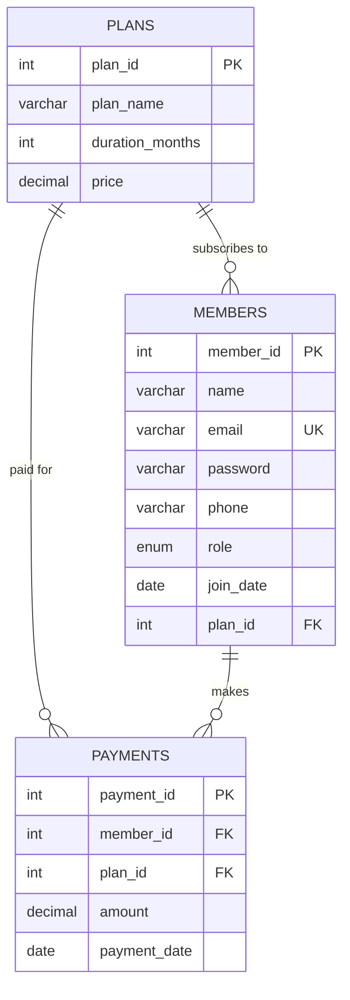
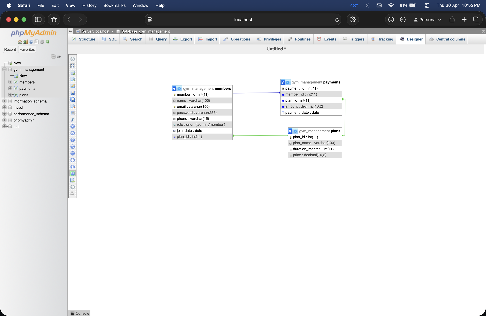
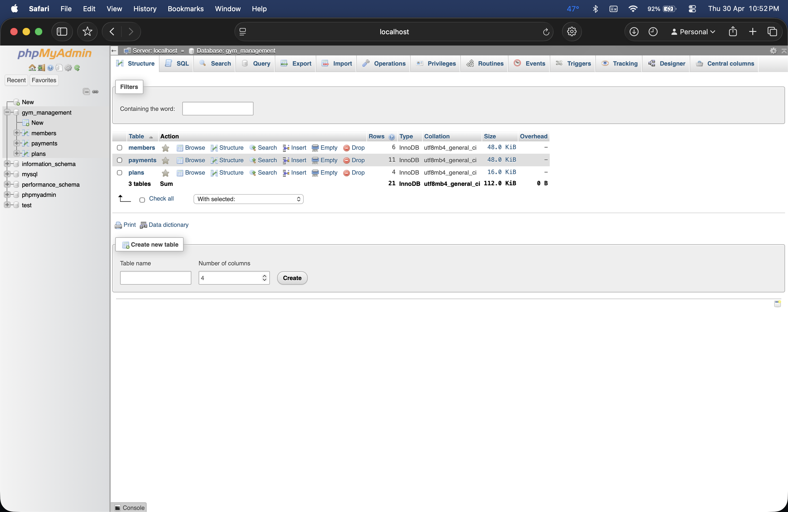
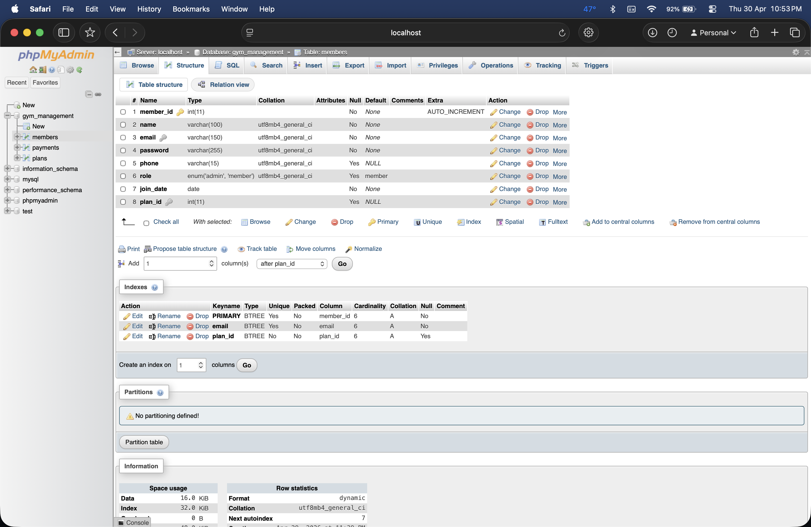
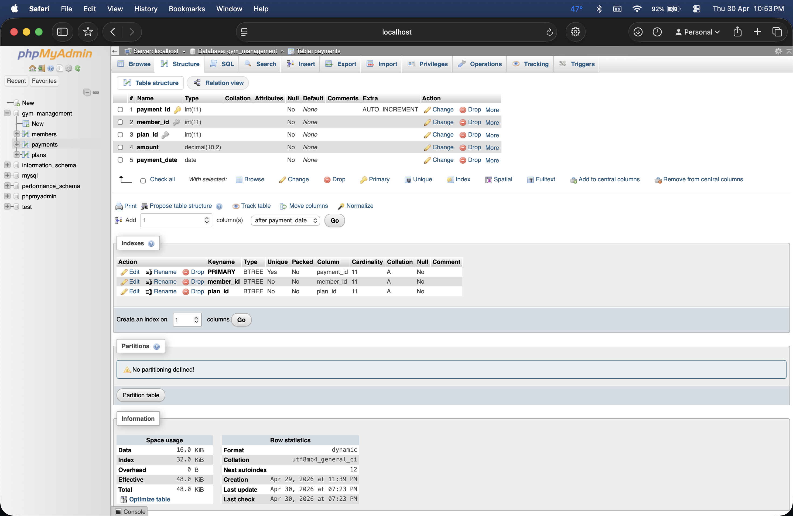
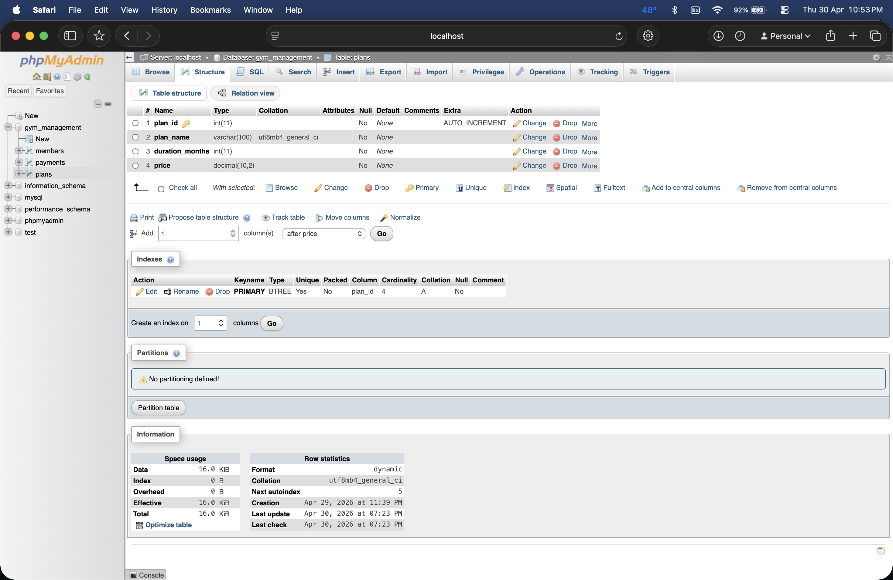
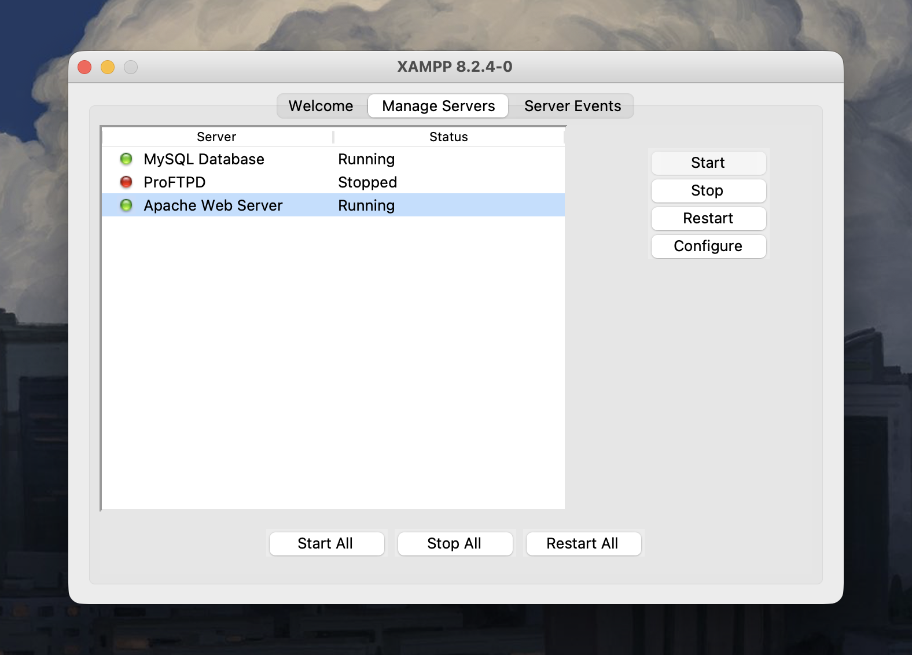

  DATABASE

# Database — gym_management

This folder contains all database assets for the GymFlow project.

 

## Contents

| File | Description |
|:---|:---|
| `gym_management.sql` | Complete phpMyAdmin SQL dump — creates all tables, indexes, constraints, and seed data |
| `screenshots/` | Visual documentation of the database structure from phpMyAdmin |

 

---

 

## Schema Overview

Three tables with foreign key relationships:

 

### Plans

| Column | Type | Notes |
|:---|:---|:---|
| `plan_id` | `INT` | Primary key, auto-increment |
| `plan_name` | `VARCHAR(100)` | Basic, Standard, Premium, Annual |
| `duration_months` | `INT` | 1, 3, 6, or 12 |
| `price` | `DECIMAL(10,2)` | Amount in ₹ |

### Members

| Column | Type | Notes |
|:---|:---|:---|
| `member_id` | `INT` | Primary key, auto-increment |
| `name` | `VARCHAR(100)` | Full name |
| `email` | `VARCHAR(150)` | Unique — used for login |
| `password` | `VARCHAR(255)` | Bcrypt hash |
| `phone` | `VARCHAR(15)` | Nullable |
| `role` | `ENUM('admin','member')` | Defaults to `member` |
| `join_date` | `DATE` | Registration date |
| `plan_id` | `INT` | FK → `plans.plan_id` |

### Payments

| Column | Type | Notes |
|:---|:---|:---|
| `payment_id` | `INT` | Primary key, auto-increment |
| `member_id` | `INT` | FK → `members.member_id` |
| `plan_id` | `INT` | FK → `plans.plan_id` |
| `amount` | `DECIMAL(10,2)` | Amount paid |
| `payment_date` | `DATE` | Date of payment |

 

---

 

## Importing the Database

### Option A — Import the SQL dump (fastest)

1. Open phpMyAdmin → [`http://localhost/phpmyadmin`](http://localhost/phpmyadmin)
2. Click **Import** in the top navigation
3. Select `gym_management.sql` from this folder
4. Click **Go**

This creates the database, all three tables, indexes, constraints, and populates them with seed data including an admin account and 4 test members.

### Option B — Step-by-step setup

Follow the guided instructions in [`docs/DATABASE_SETUP.md`](../docs/DATABASE_SETUP.md) to create each table manually and understand the schema.

 

---

 

## Screenshots from phpMyAdmin

### ER Diagram — Table Relationships

 

### Database Tables Overview

 

### Members Table Structure

 

### Payments Table Structure

 

### Plans Table Structure

 

---

 

## XAMPP Server Configuration

The project runs on XAMPP with Apache and MySQL:

| Service | Status |
|:---|:---|
| MySQL Database | Running |
| Apache Web Server | Running |
| XAMPP Version | 8.2.4-0 |

 

---

 

  See <a href="../docs/DATABASE_SETUP.md">DATABASE_SETUP.md</a> for step-by-step SQL commands to build this schema from scratch.

