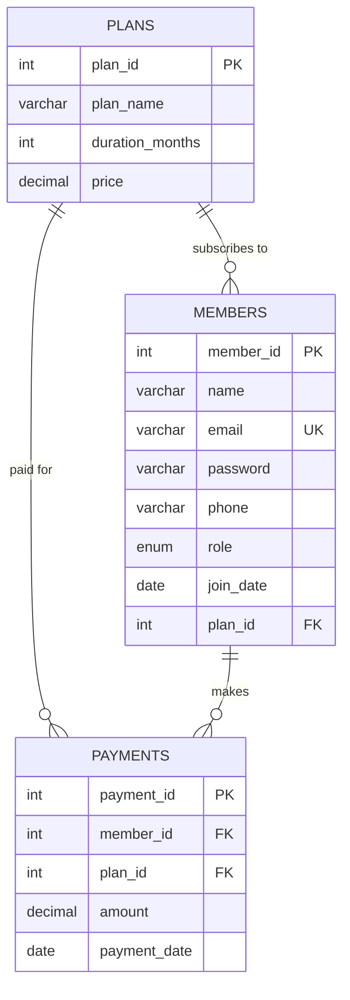

<p align="center">
  <sub>DOCS / DATABASE SETUP</sub>
</p>

# Database Setup — Step by Step

This guide walks through creating the `gym_management` database from scratch using phpMyAdmin. Each step is a single SQL block — paste them in order.

<br/>

> **Prefer a one-click import?** Use the full SQL dump at [`database/gym_management.sql`](../database/gym_management.sql) instead.

<br/>

---

<br/>

## Prerequisites

- XAMPP running with **Apache** and **MySQL** active
- phpMyAdmin open at [`http://localhost/phpmyadmin`](http://localhost/phpmyadmin)
- Click the **SQL** tab to enter queries

<br/>

---

<br/>

## Step 1 — Create the database

```sql
CREATE DATABASE gym_management;
```

> **⚠ After running this:** select **`gym_management`** from the left sidebar before continuing.

<br/>

---

<br/>

## Step 2 — Create the `plans` table

Plans must be created first because `members` and `payments` reference it via foreign keys.

```sql
CREATE TABLE plans (
    plan_id        INT AUTO_INCREMENT PRIMARY KEY,
    plan_name      VARCHAR(100)   NOT NULL,
    duration_months INT           NOT NULL,
    price          DECIMAL(10, 2) NOT NULL
);
```

<br/>

---

<br/>

## Step 3 — Create the `members` table

```sql
CREATE TABLE members (
    member_id INT AUTO_INCREMENT PRIMARY KEY,
    name      VARCHAR(100)  NOT NULL,
    email     VARCHAR(150)  NOT NULL UNIQUE,
    password  VARCHAR(255)  NOT NULL,
    phone     VARCHAR(15),
    role      ENUM('admin', 'member') DEFAULT 'member',
    join_date DATE          NOT NULL,
    plan_id   INT,
    FOREIGN KEY (plan_id) REFERENCES plans(plan_id)
);
```

| Column | Purpose |
|:---|:---|
| `email` | Unique — used as login identifier |
| `password` | Stores bcrypt hash (never plaintext) |
| `role` | Controls access — `admin` or `member` |
| `plan_id` | Links to the member's current subscription plan |

<br/>

---

<br/>

## Step 4 — Create the `payments` table

```sql
CREATE TABLE payments (
    payment_id  INT AUTO_INCREMENT PRIMARY KEY,
    member_id   INT            NOT NULL,
    plan_id     INT            NOT NULL,
    amount      DECIMAL(10, 2) NOT NULL,
    payment_date DATE          NOT NULL,
    FOREIGN KEY (member_id) REFERENCES members(member_id),
    FOREIGN KEY (plan_id)   REFERENCES plans(plan_id)
);
```

<br/>

---

<br/>

## Step 5 — Seed the plans

```sql
INSERT INTO plans (plan_name, duration_months, price) VALUES
    ('Basic',    1,   500.00),
    ('Standard', 3,  1200.00),
    ('Premium',  6,  2000.00),
    ('Annual',  12,  3500.00);
```

| Plan | Duration | Price (₹) |
|:---|:---|:---|
| Basic | 1 month | 500 |
| Standard | 3 months | 1,200 |
| Premium | 6 months | 2,000 |
| Annual | 12 months | 3,500 |

<br/>

---

<br/>

## Step 6 — Create the admin account

The password below is a bcrypt hash of **`admin123`**.

```sql
INSERT INTO members (name, email, password, phone, role, join_date, plan_id) VALUES
    ('Admin', 'admin@gym.com',
     '$2y$10$Qo.qpn9vnkJwD8GXmXgEi.Un.g92JXOEUdGaxE9o44TPzpgHTsCVW',
     '9999999999', 'admin', CURDATE(), NULL);
```

> **Login:** Email `admin@gym.com` · Password `admin123`

<br/>

---

<br/>

## Step 7 — Seed test members

Passwords are bcrypt hashes. See [`TEST_CREDENTIALS.md`](TEST_CREDENTIALS.md) for plaintext passwords.

```sql
INSERT INTO members (name, email, password, phone, role, join_date, plan_id) VALUES
    ('Aarav Sharma', 'aarav@example.com',
     '$2y$10$qtP99kC2TWuZqVhVpIJX/.0fOf030BbKBnxYGkraB.cNQLiOOOBei',
     '9876543210', 'member', '2025-06-15', 1),

    ('Priya Patel', 'priya@example.com',
     '$2y$10$RIdDfXbU/9THfVTWEwLSOerdMZIiODVH20qjXb6IgjYVkuPnQcAbG',
     '9876543211', 'member', '2025-08-01', 2),

    ('Rohan Mehta', 'rohan@example.com',
     '$2y$10$A9U5pva4Q1nRAVfeKwaGpebZeyuLKpwc7Fxuv9YeZv2B9BFrHFo8.',
     '9876543212', 'member', '2025-11-10', 3),

    ('Sneha Iyer', 'sneha@example.com',
     '$2y$10$sJHHy3SIryClH7t/MoCf3e1WuofcJ7EWosZ6uSddDESzJRorbxUIm',
     '9876543213', 'member', '2026-01-20', 4);
```

<br/>

---

<br/>

## Step 8 — Seed payment history

> Member IDs assume: Admin = 1, Aarav = 2, Priya = 3, Rohan = 4, Sneha = 5.

```sql
INSERT INTO payments (member_id, plan_id, amount, payment_date) VALUES
    (2, 1,   500.00, '2025-06-15'),
    (3, 2,  1200.00, '2025-08-01'),
    (4, 3,  2000.00, '2025-11-10'),
    (5, 4,  3500.00, '2026-01-20'),
    (2, 1,   500.00, '2026-02-15'),
    (3, 2,  1200.00, '2026-03-01'),
    (4, 3,  2000.00, '2026-03-10'),
    (5, 4,  3500.00, '2026-04-05'),
    (2, 1,   500.00, '2026-04-15'),
    (3, 2,  1200.00, '2026-04-22'),
    (2, 1,   500.00, '2026-05-01'),
    (4, 3,  2000.00, '2026-05-02'),
    (5, 4,  3500.00, '2026-05-01');
```

<br/>

---

<br/>

## Schema Diagram



<br/>

---

<br/>

<p align="center">
  <sub>Database setup complete — return to the <a href="../README.md">main README</a> for next steps.</sub>
</p>
