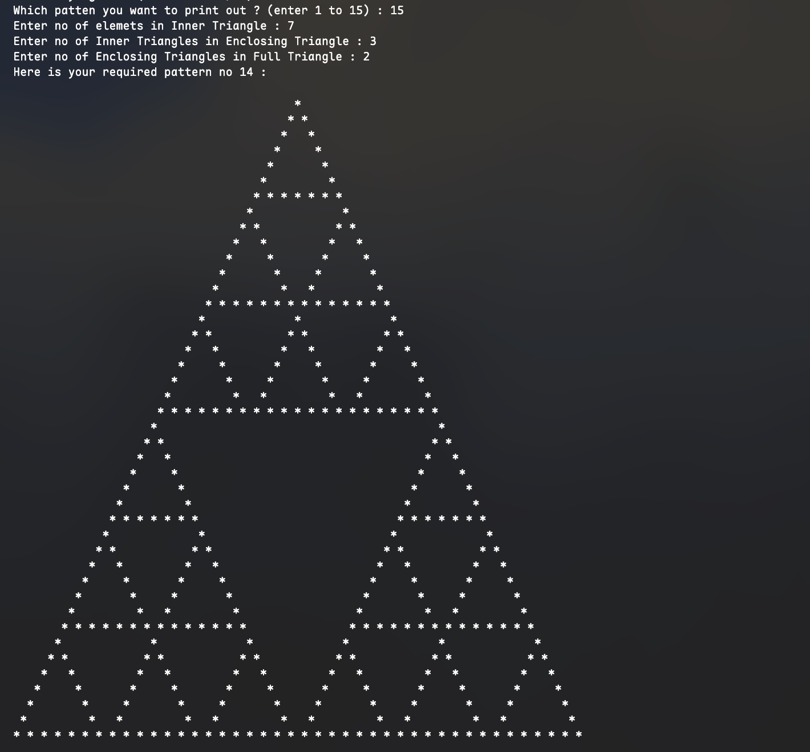
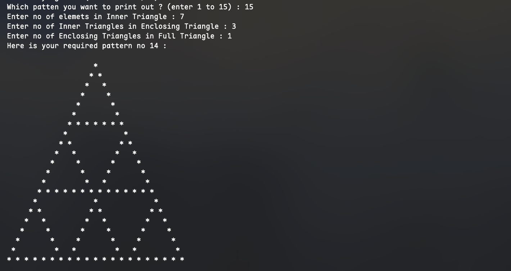
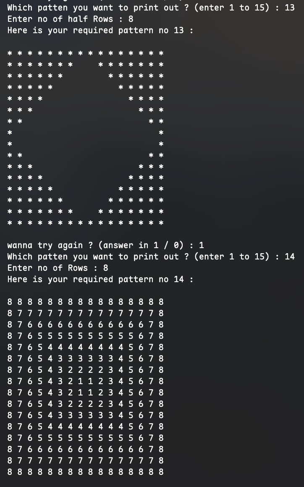
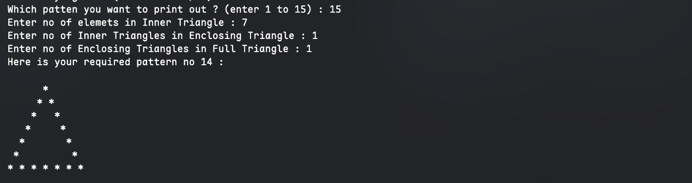
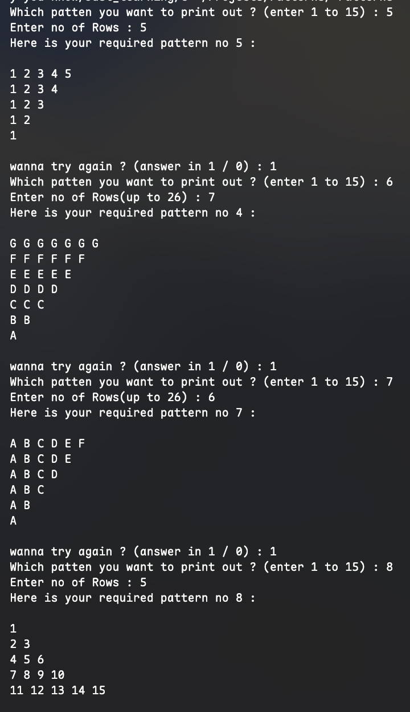
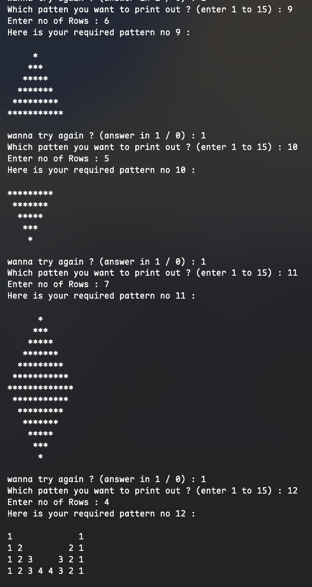

# ℙattern Generator 

⁍ **Overview**
A sophisticated C++ pattern engine utilizing a `static` class architecture. This project explores coordinate geometry and nested looping structures to render 15 unique mathematical and fractal-style patterns.

---

### $\nabla$ Visual Catalog

The following screenshots demonstrate the output of the generator, ranging from simple grids to complex recursive fractals.

#### $\bullet$ Fractal & Recursive Structures
> Patterns involving high-level nested logic and relative spacing.

| **The Sierpinski-style Fractal** | **Recursive Nested Triangles** |
| :---: | :---: |
|  |  |
| *Complexity: 𝒪(m⋅n⋅base)* | *Output of Pattern 15* |

#### $\bullet$ Symmetrical & Coordinate Grids
> Patterns utilizing coordinate mapping and distance logic.

| **Concentric Number Square** | **Reflective Hollow Diamond** |
| :---: | :---: |
|  |  |
| *Logic: $min(x, y)$ Mapping* | *Output of Patterns 13 & 14* |

#### $\bullet$ Sequence & Character Matrices
> Exploring ASCII values and incremental step logic.

| **Alpha & Step Grids** | **Inverted Pyramid Logic** |
| :---: | :---: |
|  |  |
| *Character Mapping* | *Output of Patterns 5–12* |

---

### $\Delta$ Technical Architecture

The engine is built around a **Static Dispatch Table**. By using an array of function pointers, the program achieves $O(1)$ selection of the desired pattern without the overhead of long conditional chains.

```cpp
// Static function pointer array for pattern selection
static void (*print_pattern[])(void);
```

### $\int$ Core Logic Highlights

* **Distance Transform:** Pattern 14 implements a distance-from-edge algorithm to create concentric number rings.
* **Fractal Nesting:** Pattern 15 uses nested for-loops with dynamic padding to create self-similar triangle structures.
* **ASCII Arithmetic:** Character patterns are generated using base-offset logic: $(char)('A' + index)$.

---